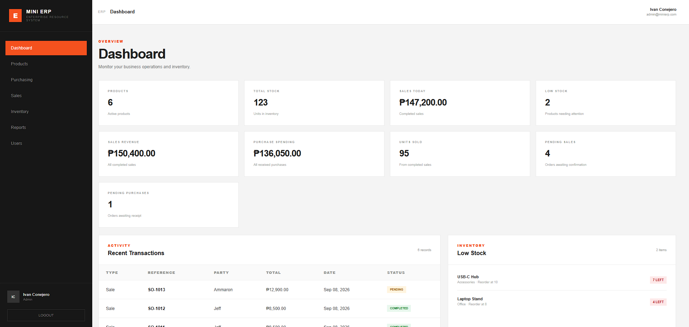

# Mini ERP

<p align="center">
  
</p>

<p align="center">
  A lightweight Enterprise Resource Planning system built with React and Vite for managing products, purchasing, sales, inventory, reports, and users.
</p>

<p align="center">
  
  
  
  
  
</p>

---

## About the Project

The Mini ERP is a web-based business management application designed to bring common business operations into a single system.

The system demonstrates frontend development, component-based React architecture, CRUD operations, multi-product transactions, inventory management, role-based access control, data persistence, and business reporting.

---

## Features

### Product Management
- Add new products
- Edit existing products
- Delete products
- Search products
- Manage product pricing
- Manage stock and reorder levels
- Prevent duplicate SKUs

### Purchasing Management
- Create purchase orders
- Add multiple products to a purchase
- Set product quantities and costs
- Track pending purchases
- Receive purchase orders
- Automatically increase inventory after receiving
- Record inventory IN movements

### Sales Management
- Create sales orders
- Add multiple products to a sale
- Select customers
- Track pending sales
- Confirm sales
- Automatically deduct inventory after confirmation
- Prevent sales confirmation when available stock is insufficient

### Inventory Management
- View current product stock
- Adjust inventory manually
- Perform IN and OUT stock adjustments
- Prevent OUT adjustments from exceeding available stock
- Track inventory movement history

### Reports
- View sales revenue
- View purchase spending
- View inventory valuation
- Track units sold
- Track units purchased
- View best-selling products
- View purchased products
- View sales and purchasing summaries

### User Management
- Add users
- Edit users
- Activate and deactivate users
- Delete users
- Assign user roles
- Role-based system access

---

## User Roles

| Role | Access |
|------|--------|
| Admin | Full system access including user management |
| Staff | Products, purchasing, sales, inventory, and reports |
| User | Products and personal sales orders |

---

## Technologies Used

### Frontend
- React
- Vite
- JavaScript
- HTML5
- CSS3

### Data Storage
- Browser LocalStorage

### Development
- Visual Studio Code
- Git
- GitHub

---

## System Highlights

### Integrated Business Workflow

The system connects purchasing, sales, and inventory operations together.

```text
Products
   ↓
Purchasing → Receive Purchase → Inventory ↑
   ↓
Sales → Confirm Sale → Inventory ↓
   ↓
Reports

---

## Live Demo 
[View Live Demo](https://mini-erp-snowy.vercel.app/)
